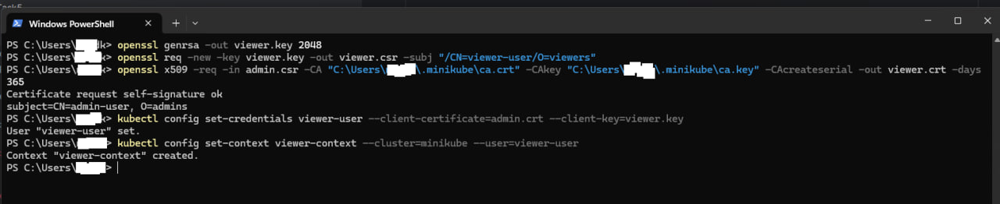
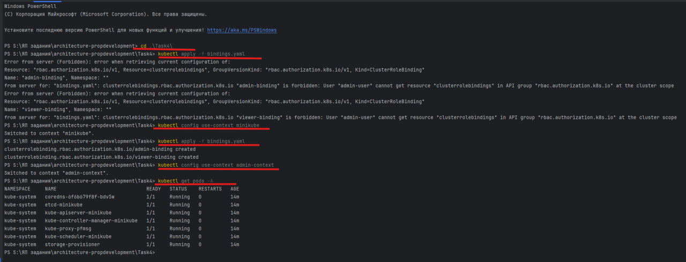
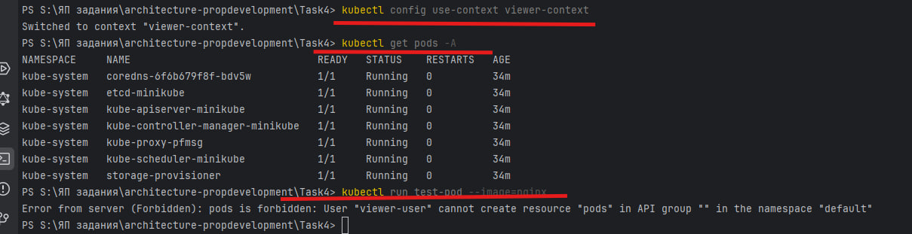

| Роль   | Полномочия                            | Группа пользователей         |
|--------|----------------------------------------|------------------------------|
| viewer | Просмотр ресурсов                      | Аналитики, Бухгалтер         |
| admin  | Полный доступ + просмотр секретов      | Архитектор, ИБ               |

# Поднятие Minikube
- minikube delete
- minikube start --driver=docker --wait=all

# Проверка статуса
- kubectl get nodes
- kubectl cluster-info

# Создание пользователя admin-user

- команды в файле create-users.sh
- аналогично создание viewer-user

# создание roles.yaml 

# создание bindings.yaml

# Применение ролей и привязок (из контекста minikube)
- kubectl config use-context minikube
- kubectl apply -f roles.yaml
- kubectl apply -f bindings.yaml

# Проверка прав
## Переключение контекста и проверка:
- kubectl config use-context admin-context
- kubectl get pods -A

- kubectl config use-context viewer-context
- kubectl get pods -A

