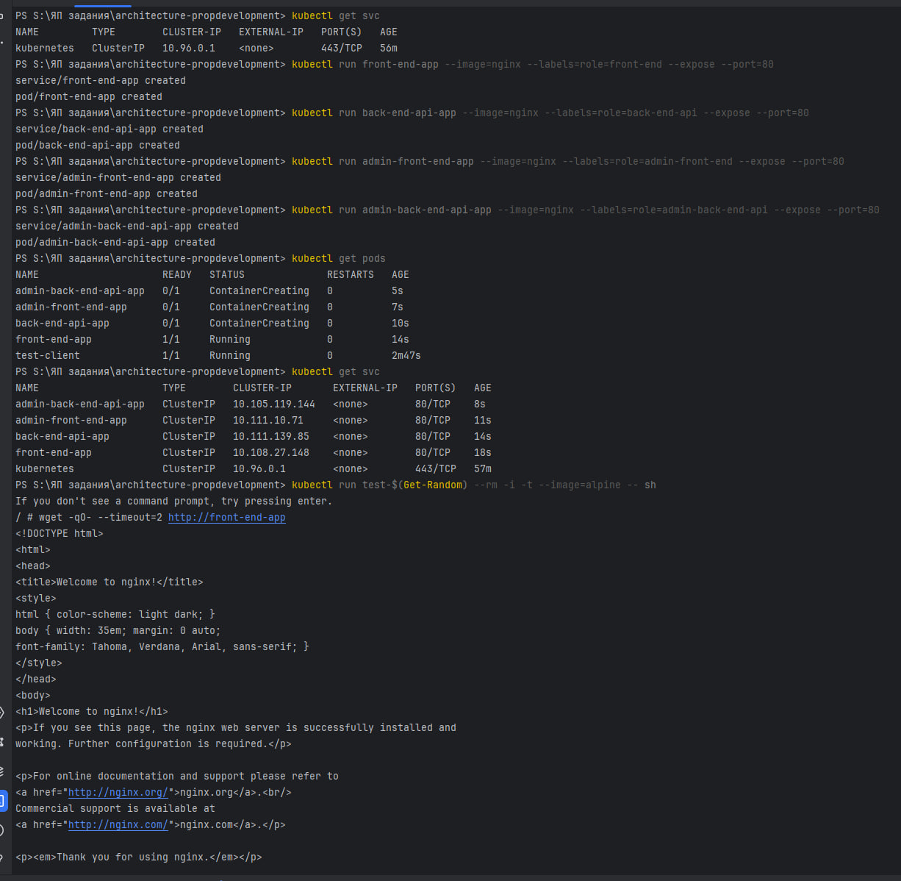
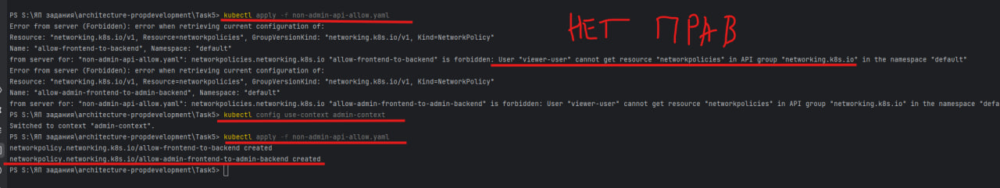
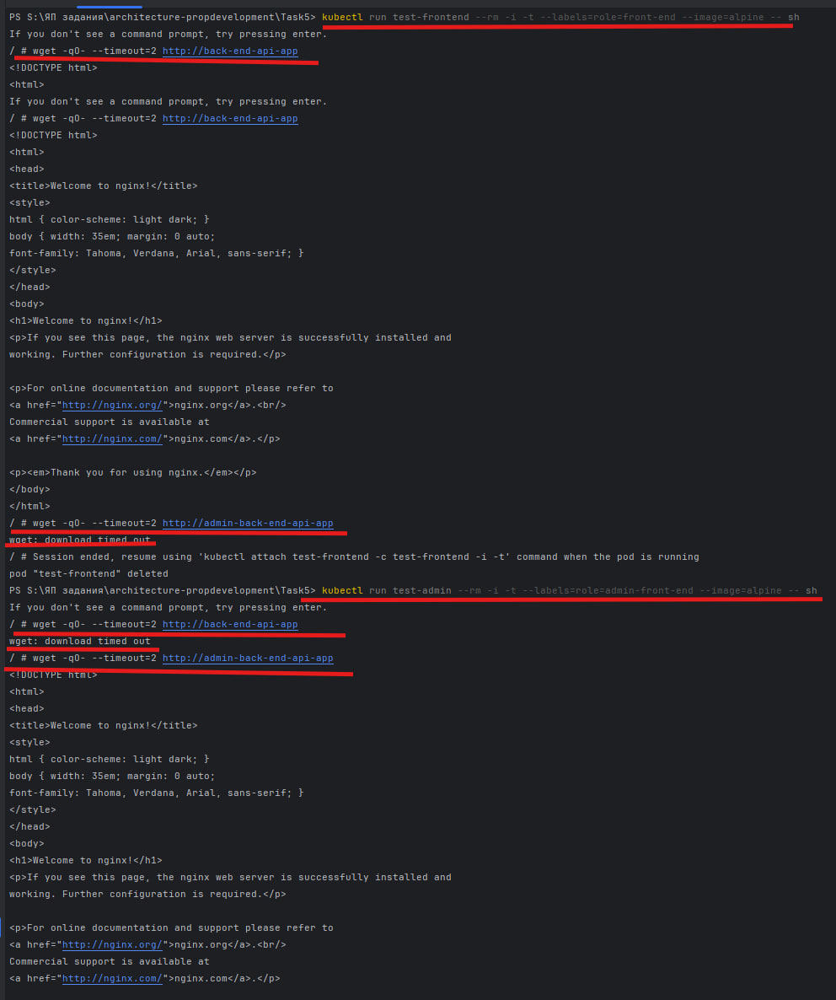

# Задание 5: Управление трафиком между подами (NetworkPolicy)

## Поднять кластер с поддержкой CNI (Calico)
- minikube delete
- minikube start --cni=calico --network-plugin=cni --wait=all

## Создать 4 пода с метками и сервисами
- kubectl run front-end-app --image=nginx --labels=role=front-end --expose --port=80
- kubectl run back-end-api-app --image=nginx --labels=role=back-end-api --expose --port=80
- kubectl run admin-front-end-app --image=nginx --labels=role=admin-front-end --expose --port=80
- kubectl run admin-back-end-api-app --image=nginx --labels=role=admin-back-end-api --expose --port=80

##  Проверка применения под неверной ролью сетевых политик

- использование admin-context

##  Применить сетевые политики ( non-admin-api-allow.yaml )
- kubectl apply -f non-admin-api-allow.yaml

##  Проверка соединений Войти в под от front-end
kubectl run test-frontend --rm -i -t --labels=role=front-end --image=alpine -- sh
- wget -qO- --timeout=2 http://back-end-api-app # ? должно работать
- wget -qO- --timeout=2 http://admin-back-end-api-app # ? не должно работать

##  Проверка соединений Войти в под от admin-front-end:
kubectl run test-admin --rm -i -t --labels=role=admin-front-end --image=alpine -- sh
- wget -qO- --timeout=2 http://back-end-api-app # ? не должно работать
- wget -qO- --timeout=2 http://admin-back-end-api-app # ? должно работать

